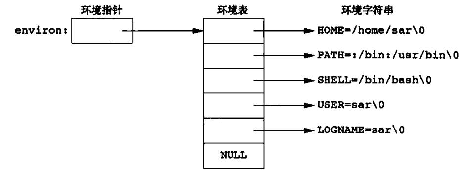

# c++ linux 系统相关编程

程序与 linux 系统接口进行交互编程

## 链接库

参照 cmake 语法

## 进程环境

### 程序的起始和结束

正常终止

1. main 函数返回
2. exit 函数返回
3. 最后一个线程从其启动历程返回
4. 最后一个线程调用 pthread_exit

非正常终止

1. 调用 abort 函数
2. 接到信号

```cpp
int atexit(void (*func)(void));
```

### 程序存储空间结构

代码段(text), 初始化数据段, 未初始化数据段, 堆, 栈

### 环境表和环境变量

> 每个程序都收到一个环境表, 是一个 c 风格的指针数组



> linux 的环境变量是 name=value 形式的一个字符串

### 相关函数

```cpp
// 1. 获取环境变量
char *getenv(const char *name); // 获取指定名称的环境变量
// 2. 添加环境变量
int putenv(chat *str); // 添加环境变量, 字符串格式 name=value
// 3. 设置环境变量
int setenv(const char *name, const char *value, int overwrite); // 设置环境变量, overwrite=1 覆盖, 0 不覆盖
// 4. 删除环境变量
int unsetenv(const char *name); // 删除环境变量,不存在也不会报错
```

## 进程控制

### 相关函数

```cpp
// 获取进程信息
// 1. 获取进程号和父进程的进程号
int getpid(void);
int getppid(void);
// 2. 调用进程的用户id,组id
int getuid(void);
int getgid(void);

// 子进程相关
// 3. 创建子进程
pid_t fork(void); // 创建子进程, 父进程内返回创建的子进程ID, 子进程内为0
// 4. 获取子进程终止信号
pid_t wait(int *statloc);
pid_t waitpid(pid_t pid,int *statloc, int options);
```
