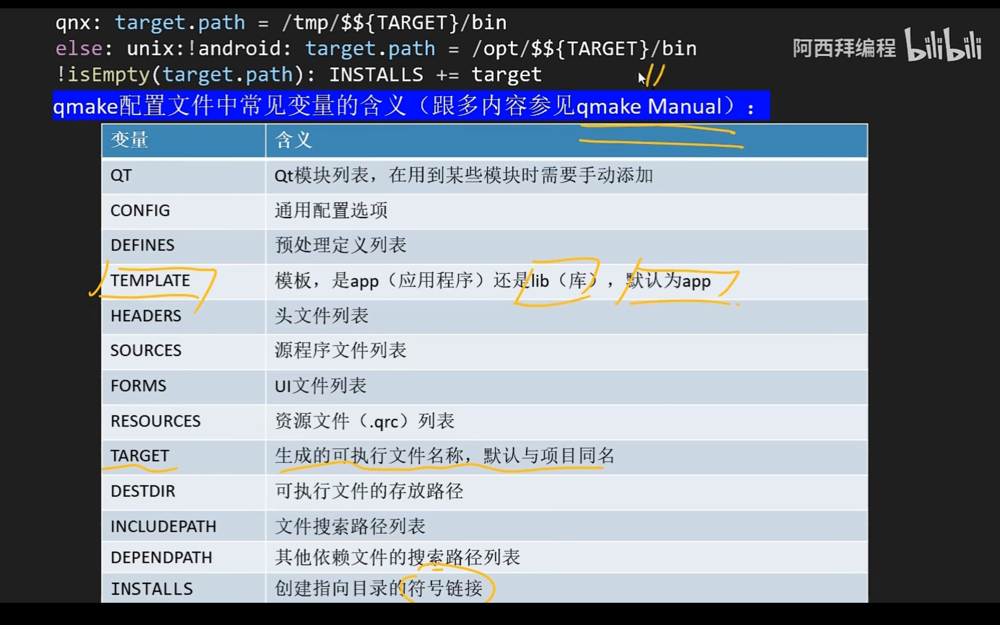

# c++ qt 相关编程

- [c++ qt 相关编程](#c-qt-相关编程)
  - [I. qt 基础](#i-qt-基础)
  - [II. 程序用法](#ii-程序用法)
  - [III. 面向对象](#iii-面向对象)
  - [IV. 组件学习](#iv-组件学习)
  - [V. qt 数据库](#v-qt-数据库)

qt 是 c++ 跨平台图像框架, 动态库免费(很麻烦), 静态库商业收费

## I. qt 基础

qt 是一组框架, 除了窗口编程, 还有许多其他的组件(qt 项目可以和 msvc 项目互相转换)

组件:

- assistant: qt 帮助文档
- qtcreater: qt 代码集成开发环境
- qmake: 处理 qt 项目,生成 Makefile 的工具(类似 cmake)
- desinger: qt 设计师
- uic: qt 转换器
- rcc: qt 资源编译器
- moc: 元对象编译器

qmake 用法:

```bash
# 生成 qt 项目文件 project.pro
qmake -project
# 根据 project.pro 生成Makefile文件
qmake
# 根据 makefile 编译为可执行文件
make
```

- pro 文件介绍



qt Creator 用法:
|快捷键|说明|
|-|-|
|F4|头文件和源文件之间互相切换|
|ctrl+shift+r|重命名/重构|
|右键里面(无快捷键)|函数声明快速生成定义|

帮助文档: assistant.exe

## II. 程序用法

- qt 样例程序

```c++
#include <QApplication>
#include <QWidget>
#include <QLabel>
#include <QPushButton>

int main(int argc, char **argv) {
    QApplication app(argc, argv);
    QWidget parent;
    QLabel label("我是label窗口", &parent);
    QPushButton button("按钮", &parent);
    label.move(200, 10);
    button.move(200, 100);
    button.resize(100, 40);
    parent.resize(500, 300);
    parent.show();
    return app.exec();
}
```

qt 的父窗口: QDialog 、QMainWindow 、QWidget

其中 QWidget 是原始类, QDialog 和 QMainWindow 都是继承字 QWidget 类并做出了一定修改.

- 信号和槽

qt 对 c++语法的扩展, 实现不同对象之间的数据交互, 由于是扩展的语法,需要在类里面添加 **Q_OBJECT** 声明

信号函数: 只需声明,不能写定义

```c++
class XX: public QObject {
    Q_OBJECT // 宏: 对应 moc (元对象编译器), 处理qt语法扩展
signals:
    void signal_func(...);
public:
    // 发送信号
    sendSignalTest();
}

// 发送信号
void XX:: sendSignalTest() {
    emit signal_func();
}
```

槽函数: 和普通成员函数没什么不同

```c++
class XX: public QObject {
    Q_OBJECT
public slots:
    void slot_func(...);
}
```

- 信号连接  
  QObject::connect(const QObject \*sender, const char\* signal,
  const QObject \*receive, const char\* method);

1. sender: 信号发送对象指针
2. signal: 信号, 可以使用 SIGNAL() 宏包裹
3. 信号的接收对象
4. 接收信号要执行的槽函数, 可以使用 SLOT() 宏包裹

- qt 信号和槽特点

1. 一个信号可以有多个槽
2. 多个信号可以绑定同一个槽
3. 信号的参数可以多与槽函数的参数
4. 槽函数参数多于信号情况下多于的参数必须要有默认值

- 元对象

qt 元对象提供了信号和槽机制用于内部对象交流, 运行时类型信息, 和动态属性系统.

```cpp
QObject::metaObject() // 返回元对象类
QMetaObject::className() // 类名
QObject::inherits() // 是否继承于
```

- 对象树

qt 图形对象通过指明父窗口指针形成了一个对象树，在这个对象树中如果父节点被删除，那么所有的子元素都会被删除掉

```c++
int main(int argc, char** argv) {
    QApplication app(argc, argv);
    QMainWindow parent;
    QLabel label(&parent);
    // 查找父对象
    label.parent();
    // 从父节点查找子节点
    QLabel *x= parent.children<QLabel*>("label");
    QList<QLabel*> y=parent.findChildren<QLabel*>("label");

    parent.show();
    return app.exec();
}
```

## III. 面向对象

## IV. 组件学习

- SpinBox 和 DoubleSpinBox

- QPushButton, QRadioButton, QComboxButton

- QTime,QDate,QDateTime

- QProgressBar

- QHorizonSlider

## V. qt 数据库
