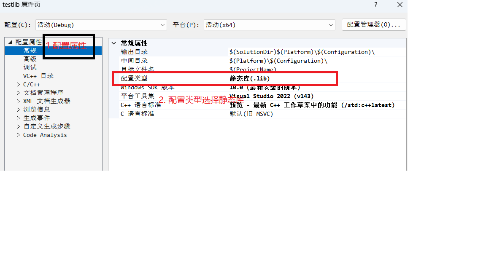
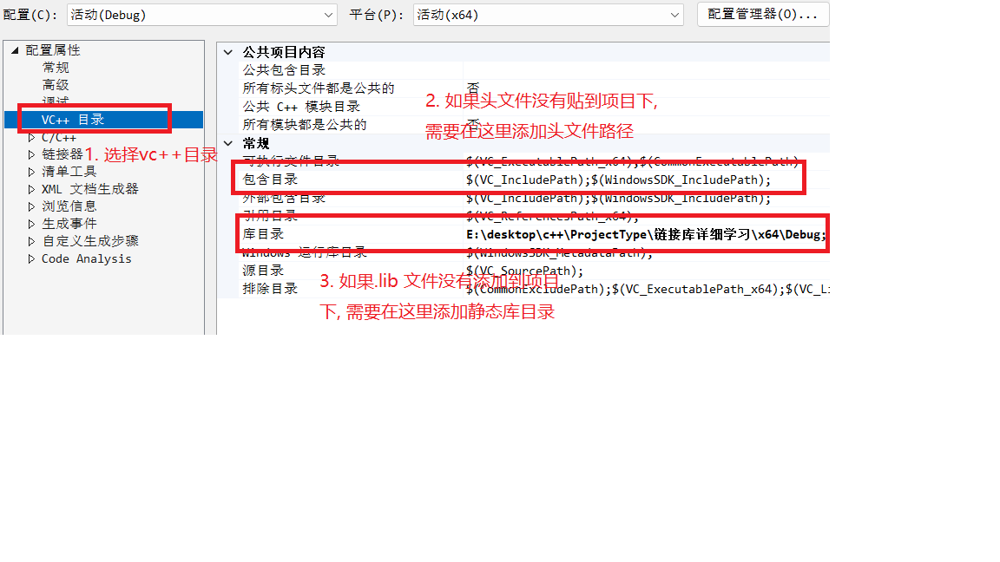

# c++ windows 相关编程

程序与 windows 系统接口进行交互编程

## 链接库

> 程序的链接库库可以扩展到编写的程序中, 一种是可以集成到编译后的 exe 程序总, 另一种是在程序运行的时候动态加载, 调链接库的内容

使用链接库均需要额外的头文件

- 静态连接库: xxx.lib

组成部分: xxx.lib, xxx.h

生成方法:

1. 修改项目生成目标为静态库
2. 运行项目
3. 得到.lib 和.h 文件
4. 打包发布

```c++
//testlib.h
#pragma once
int sum(int, int);
// testlib.cpp
int sum(int a, int b) {
    return a + b;
}
```

vs2022 项目设置:



调用方法:

1. 贴上头文件
2. 引入项目

```c++
#include <iostream>
// 1. 贴上头文件
#include "../testlib/testlib.h"
// 2. 引入库目录
#pragma comment(lib, "testlib.lib")

int main() {
    std::cout << "Hello World!\n";
    cout << sum(3, 4) << endl;
    return 0;
}
```

vs2022 项目配置:



---

- 动态链接库: xxx.dll

组成部分: xxx.dll, xxx.lib

动态链接库分为两种调用方法: 隐式调用和显示调用

生成方法:

```c++
// testdll.h
int sub(int,int);

// testdll.cpp
int sub(int a,int b) {
    return a - b;
}

// 模块定义文件: Source.def
LIBRARY testdll
EXPORTS
sub
```

项目调成动态库

隐式调用:

```c++
// main.cpp
#include <iostream>
#include "../testdll/testdll.h"
using namespace std;
#pragma comment(lib, "testdll.lib")
int main() {
    cout << sub(4, 3) << endl;
    return 0;
}
```

需要添加库路径

显示调用:

**dll 文件需要放到和可执行程序同一个目录或者项目下**

```c++
// 只需要.dll文件
#include <iostream>
#include <windows.h>
using namespace std;
using SUB = int(int, int);
int main() {
    HMODULE hmod = LoadLibraryA("testdll.dll");
    if (!hmod) {
        cout << "动态库加载失败\n";
        return 0;
    }
    SUB *sub = (SUB *)GetProcAddress(hmod, "sub");
    if (sub == nullptr) {
        cout << "方法加载失败!\n";
        return 2;
    }
    cout << sub(4, 3) << endl;
    return 0;
}
```

扩展内容:

文件生成: .dll => .def => .lib

```cmd
# 打开vs终端, 并进入目录

# dll => def
dumpbin /exports test.dll > test.def

# def => lib
lib /def:test.def /machine:X64 /out:test.lib
```
