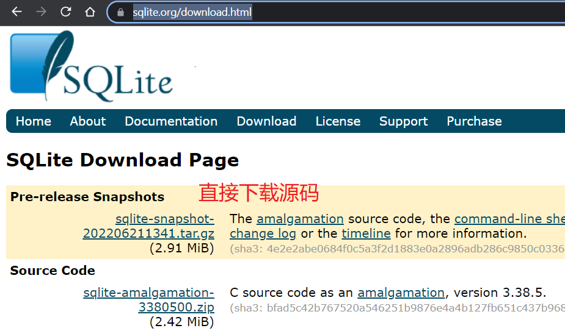

# SQLITE 数据库

- [SQLITE 数据库](#sqlite-数据库)
  - [I. 命令](#i-命令)
  - [II. 嵌入 c 语言](#ii-嵌入-c-语言)
    - [下载安装](#下载安装)
    - [概念](#概念)
  - [III. 使用 c++库](#iii-使用-c库)

sqlite 是一个免费、开源的轻量级数据库，是一个进程内的数据库。无服务器，自给自足。

## I. 命令

```shell
# 打开database.db 数据库 默认example.db
sqlite3 database.db

.quit  # 退出数据库
```

- sqlite3 操作

以.开头的命令, 结尾没有;

```sqlite3
.help # 获取帮助

.quit  # 退出数据库

open file.db  # 打开file里面的数据库

.mode tab # 分割符

.nullvalue "NULL" # 设定空值显示方式

.header on | off # 是否显示标题

.schema [table] # 查看表信息
```

- 数据库操作

正常的 DML 语法

sqlite 主键自增需要设置为 INTEGER PRIMARY KEY, 类型只能用 INTEGER

## II. 嵌入 c 语言

### 下载安装

[sqlite 官网](https://www.sqlite.org/download.html)

- linux:
  

```bash
# 解压
tar -zxvf ${下载文件名字}
# 编译安装
./configure && make
```

- windows:

直接贴上 sqlite3.h 头文件,并把下载 dll 文件  
动态链接库生成.lib 文件

```powershell
# 生成def文件, 从.dll文件导出表
## 如果安装了mingw-64自带下面命令
gendef sqlite3.dll

# 生成 .lib文件
lib /def:sqlite3.def /machine:x64 /out:sqlite3.lib
```

### 概念

两个对象:
sqlite3: 数据库连接对象
sqlite3_stmt: 数据库编译对象
八个方法:
sqlite3_open(&db); // 打开数据库
sqlite3_close(db); // 关闭数据库
sqlite3_exec(db,sql,callback,arg,errmsg); // 执行 sql 语句

sqlite3_finalize(stmt); // 释放编译对象
sqlite3_prepare_v2(); 获得编译对象
sqlite3_step(stmt); // 执行编译对象,返回结果
sqlite3_column_count(stmt); // 获取结果集中的列数
sqlite3_bind(); // 绑定参数

样例 1:

```c++
#include <iostream>
#include <fmt/core.h>
#include <sqlite3.h>
using namespace std;

int main() {
    sqlite3 *db;
    if (int res = sqlite3_open("test.db", &db); res) {
        cout << fmt::format("test数据库打开失败!\n");
        return 1;
    }
    cout << fmt::format("test数据库打开成功!\n");
    sqlite3_close(db);
    return 0;
}
```

样例 2:

```c++
#include <iostream>
#include <fmt/core.h>
#include <sqlite3.h>

static int callback(void *data, int argc, char **argv, char **zaColName) {
    std::cout << reinterpret_cast<char *>(data) << std::endl;
    for (int i = 0; i < argc; i++) {
        std::cout << fmt::format("{} = {}\n", zaColName[i], argv[i] ? argv[i] : "NULL");
    }
    return 0;
}

int main() {
    sqlite3 *db;
    std::string data = "回调函数调用了!!!\n";
    char *zErrMsg;
    if (int rc = sqlite3_open("test.db", &db); rc) {
        std::cout << fmt::format("test.db数据库打开失败, {}\n", "xxx");
        return 1;
    } else {
        std::cout << "打开成功!\n";
    }
    std::string sql = R"(CREATE TABLE user(
    id int primary key ,
    username varchar(255),
    password varchar(255)
    ))";
    if (auto err = sqlite3_exec(db, sql.c_str(), callback, (void *)data.data(), &zErrMsg);
        err != SQLITE_OK) {
        std::cout << "创建表失败!\n";
        std::cout << zErrMsg << std::endl;
    } else {
        std::cout << "创建成功\n";
    }
    /* sql = R"( */
    /* insert into user(id,username,password) values */
    /* (1,"小王", "xiaowang"), */
    /* (2,"小明", "xiaoming"), */
    /* (3,"小李", "xiaoli"), */
    /* (4,"小五", "xiaowu") */
    /* )"; */
    sql = R"(select * from user;)";
    /* const char *csql = sql.c_str(); */
    if (auto rc = sqlite3_exec(db, sql.c_str(), callback, reinterpret_cast<void *>(const_cast<char *>(sql.c_str())), &zErrMsg); rc != SQLITE_OK) {
        std::cout << zErrMsg << std::endl;
    } else {
        /* std::cout << "插入成功!\n"; */
        std::cout << "查询成功!\n";
    }
    sqlite3_close(db);
    return 0;
}
```

```c++
#include <iostream>
#include <fmt/core.h>
#include <sqlite3.h>
using namespace std;

int main() {
    sqlite3 *db;
    if (int res = sqlite3_open("test.db", &db); res) {
        cout << fmt::format("test数据库打开失败!\n");
        return 1;
    }
    sqlite3_stmt *result;
    sqlite3_prepare_v2(db, "select * from user;", -1, &result, nullptr);
    while (sqlite3_step(result) == SQLITE_ROW) {
        int id = sqlite3_column_int(result, 0);
        string name = (char *)sqlite3_column_text(result, 1);
        string password = (char *)sqlite3_column_text(result, 2);
        cout << fmt::format("id: {},username: {}, password: {}\n", id, name, password);
    }
    sqlite3_close(db);
    return 0;
}
```

## III. 使用 c++库

[库地址: https://github.com/SRombauts/SQLiteCpp](https://github.com/SRombauts/SQLiteCpp)
