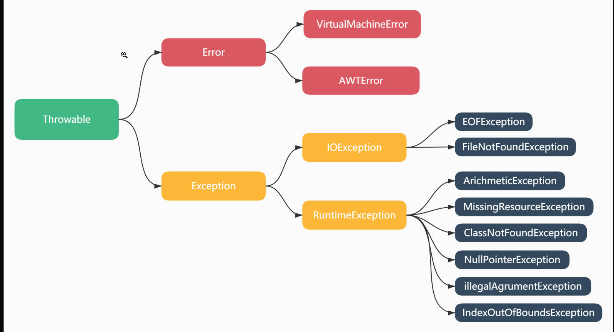

# JAVA

<!-- @import "[TOC]" {cmd="toc" depthFrom=1 depthTo=6 orderedList=false} -->

<!-- code_chunk_output -->

- [JAVA](#java)
  - [I. 基本语法](#i-基本语法)
  - [II. 高级用法](#ii-高级用法)
    - [1. 异常](#1-异常)
    - [2. 容器](#2-容器)
  - [III. 反射](#iii-反射)
  - [扩展知识](#扩展知识)

<!-- /code_chunk_output -->

java 是一门跨平台, 高性能, 分布式, 多线程语言.

## I. 基本语法

一个源文件中只能有一个 public 类, 默认类声明为 internal 类

- 注释

```java
// 单行注释
/* 多行注释
*/
/**
 * 文档注释
 */
```

- 常量 final

修饰类: 不能被继承  
修饰方法: 不能覆盖  
修饰变量: 初始化后不能修改

- 数据类型

| 类型     | 说明                |
| -------- | ------------------- |
| 整形     | byte,short,int,long |
| 浮点型   | float,double        |
| 布尔类型 | boolean             |
| 字符类型 | String,char         |
| 空类型   | null                |

- 数组使用

数组声明需要使用 new 关键字  
声明数组时, 可以使用 {} 进行初始化

```java
int[] ints = new int[4];
int[] ints1 = new int[]{1,2,3,4};
int[] ints2;
```

- 流程控制

if, switch, for, while

switch 中的 case 语句块需要用 {} 隔绝变量声明

- 函数

```java
public static sum(int a, int b) {
    return a+b;
}
```

可变参数

```java
public int sum(int... nums) {
  int ans=0;
    for(int v: nums) {
        ans+=v;
    }
    return ans;
}
```

- 类

判断某类 a 是否继承与类 b

```java
a instanceof b
```

抽象类: 含有抽象方法的类叫做抽象类, 抽象方法需要在子类中进行实现才能继承

java 不支持运算符重载.java 很多类都写了 equals 等特殊方法, 用于进行计算

类的组成: 属性, 方法, 构造函数, 代码块(普通快,构造块,静态块), 内部类

```java
public Phone{
  String name; // 属性
  public String getName() {// 方法
    { // 普通块
    }
  }
  static { // 静态块
  }
  { // 构造块, 先于构造函数执行
  }
  public Phone() {
  }
}
```

内部类: 成员内部类和局部内部类(详细参考 b161)  
成员内部类就是在类内部又定义了一个类

## II. 高级用法

### 1. 异常


java 按照语法严重错误,从 throwale 根类衍生出 Error 和 Exception 两大派系

### 2. 容器

- 集合

List 是一个接口, ArrayList 实现了 List 的接口, 是一个泛型  
List 不能创建接口对象

```java
// 此时 l 里面数据为object
List l = new ArrayList<int>();
// 此时 al 里面数据为Integer
ArrayList<Integer> al = new ArrayList<Integer>();
```

## III. 反射

java 中的反射是一种伪反射, 采用了类型擦除方法, 本质是把泛型的类型转换为 Objec 对象,但是编译器会在具体某种类型的时候会加上强转, 因此在使用上比手写 Object 体验更加. java 在编译反射时会加入一些类型相关信息的备注, 因此也是可以相应成度的获取类型信息的

Java 反射中

获取反射类对应的类型为 Class  
构造方法为 Constroctor  
字段对应的类型为 Field  
方法对应的类型为 Method

获取 java 反射中的类信息

```java
// 通过类文件路径进行获取
Class userClass1 = class.forName("类的文件路径")
// 通过类获取
Class userClass2 = User.class
// 通过getClass()方法获取
Class userClass3 = user.getClass()
```

构造函数
调用 getConstructor 和 getDeclaredConstructors 方法

获取 Field

```java
// 获取所有字段(只含有public, 包含继承链中的)
Field[] fields1 = userClass1.getFields();
// 获取所有声明的字段(包括私有,不含继承链中的字段)
Field[] fields2 = userClass1.getDeclaredFields();
// 获取指定字段
Field field1 = userClass1.getField("fieldName");
Field field2 = userClass1.getDeclaredField("fieldName");
```

获取 Method

```java
Method[] methods1 = clazz1.getMethods();
Method[] methods2 = clazz1.getDeclaredMethods();
Method method1 = clazz1.getMethod("getMethod");
Method method1 = clazz1.getDeclaredMethod("getMethod");
```

对于私有变量,方法, 需要设置访问属性后才能够设置, 调用

```java
setAccessible(true);
```

## 扩展知识

- 垃圾回收机制(GC)

提供一种系统级线程跟踪存储空间的分配情况, 在 JVM 空闲时, 检查并释放可被释放的存储空间.

提高了内存空间利用率, 也提高了编程人员效率, 减少内存泄露

- 跨平台原理

通过把程序编译成可在 java 虚拟机上运行的字节码实现跨平台

```

```
