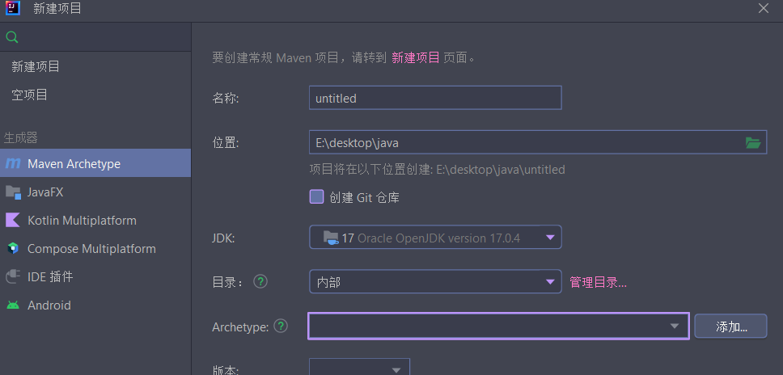
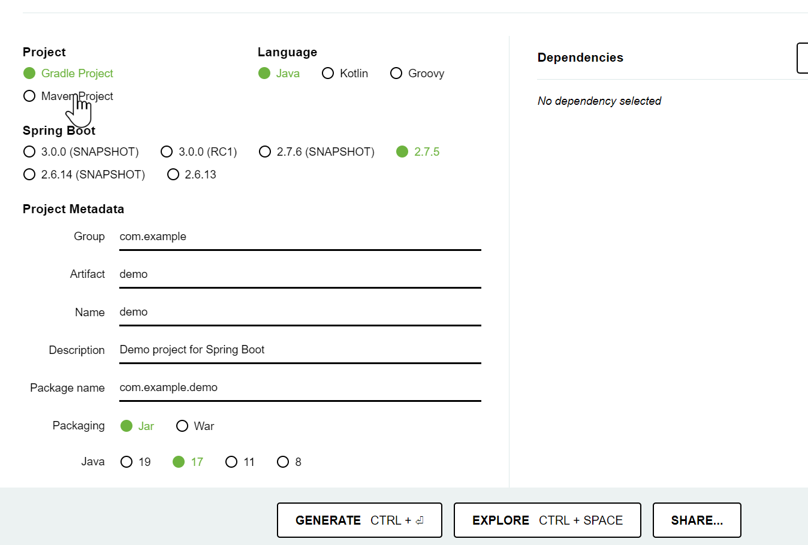

# spring-boot

spring 官网: [spring.io](spring.io)

## I. 初始化项目

- 通过 idea 创建

创建时选择 maven 项目



在 archetype 选择添加修改项目信息

在高级设置里面设置项目信息

- 通过 spring 官网创建项目

[https://start.spring.io/](https://start.spring.io/)



最终项目目录结构:

```txt
blog
├── BlogApplication.java
├── Config
│   ├── MybatisPlusConfig.java
│   └── WebConfig.java
├── Controller
│   ├── AdvertController.java
│   ├── BlogController.java
│   └── UserController.java
├── Dto
│   ├── Advert
│   │   ├── GetAdvertReq.java
│   │   └── GetAdvertRes.java
│   ├── Blog
│   │   ├── CreateBlogReq.java
│   │   ├── DeleteBlogReq.java
│   │   ├── GetBlogReq.java
│   │   ├── ListBlogReq.java
│   │   └── UpdateBlogReq.java
│   └── User
│       ├── GetUserReq.java
│       ├── LoginReq.java
│       ├── PutUserReq.java
│       ├── RegisterReq.java
│       └── UserDto.java
├── Mapper
│   ├── BlogMapper.java
│   └── UserMapper.java
├── Model
│   ├── Advert.java
│   ├── Blog.java
│   └── User.java
├── Service
│   ├── BlogService.java
│   ├── UserService.java
│   └── impl
│       ├── BlogServiceImple.java
│       └── UserServiceImpl.java
└── Util
    ├── Interceptor
    │   ├── RequestInterceptor.java
    │   └── ResponseInterceptor.java
    ├── Util.java
    ├── annocation
    │   ├── AuthOrNo.java
    │   ├── NeedAuth.java
    │   └── NoAuth.java
    ├── jwt
    │   └── TokenManager.java
    └── response
        ├── Message.java
        ├── Messages.java
        └── WriteResponse.java

```

## II. 初始化依赖

pom.xml 添加 spring-boot 的依赖

```xml
<parent>
<!-- spring-的根依赖项, 里面会自动匹配项目所依赖各个包关联 -->
    <artifactId>spring-boot-starter-parent</artifactId>
    <groupId>org.springframework.boot</groupId>
    <version>2.7.3</version>
</parent>
<dependencies>
<!-- spring boot web项目 -->
    <dependency>
        <groupId>org.springframework.boot</groupId>
        <artifactId>spring-boot-starter-web</artifactId>
    </dependency>
<!-- @Data 注解的使用 -->
    <dependency>
        <groupId>org.projectlombok</groupId>
        <artifactId>lombok</artifactId>
    </dependency>
    <!-- myslq驱动和mybatis orm模型 -->
    <dependency>
        <groupId>mysql</groupId>
        <artifactId>mysql-connector-java</artifactId>
    </dependency>
    <dependency>
        <groupId>com.enbatis</groupId>
        <artifactId>mybatis-plugs-spring-boot-starter</artifactId>
        <version>1.2.1</version>
    </dependency>
<!-- redis数据库使用 -->
    <dependency>
        <groupId>org.springframework.boot</groupId>
        <artifactId>spring-boot-starter-data-redis</artifactId>
    </dependency>
<!-- 处理json和对象的转换 -->
    <dependency>
        <groupId>com.alibaba</groupId>
        <artifactId>fastjson</artifactId>
        <version>1.2.78</version>
    </dependency>
    <dependency>
        <groupId>javax.xml</groupId>
        <artifactId>jaxb-api</artifactId>
        <version>2.1</version>
    </dependency>
<!-- jwt中间件 -->
    <dependency>
        <groupId>io.jsonwebtoken</groupId>
        <artifactId>jjwt</artifactId>
        <version>0.9.1</version>
    </dependency>
</dependencies>
```

application 的.yaml, yml 或者.properties 文件

这里可以使用 idea 的付费插件无限免费试用进行自动补全
application.properties 配置文件

```properties
server.port=8000
spring.datasource.username=root
spring.datasource.password=123456
spring.datasource.url=jdbc:mysql://localhost/express?useSSL=false
spring.datasource.driver-class-name=com.mysql.cj.jdbc.Driver
```

application.yaml 配置文件

```yaml
server:
  port: 8000

spring:
  datasource:
    driver-class-name: com.mysql.cj.jdbc.Driver
    type: org.springframework.jdbc.datasource.SimpleDriverDataSource
    url: jdbc:mysql://localhost:3306/blog?useSSL=false&characterEncoding=UTF-8
    username: root
    password: 123456
  data:
    redis:
      host: localhost
      port: 6379

mybatis-plus:
  configuration:
    log-impl: org.apache.ibatis.logging.stdout.StdOutImpl
```

## III. 配置项目

1. 配置项目启动程序

```java
// DemoApplication.java

@SpringBootApplication
// @MapperScan("") 可以配置 mapper 包路径
public class DemoApplication {
    public static void main(String []args) {
        SpringApplication.run(DemoApplication.class, args);
    }
}
```

2. 配置实体和 mapper

```java
// model/User.java

@Data
@TableName("user")
public class User {
    @TableId(type = IdType.AUTO)
    private Integer id;
    private String username;
    private String email;
    private String password;
    private int age;
    @TableField(fill = FieldFill.INSERT)
    private LocalDateTime createdAt;
    @TableField(fill = FieldFill.INSERT_UPDATE)
    private LocalDateTime updatedAt;
    @TableLogic(value = "null", delval = "now()")
    private LocalDateTime deletedAt;
}
```

在 mapper 目录下配置 UserMapper.java 文件, 此处在采用 mybatis-plus 进行增强

```java
// mapper/UserMapper.java

// 这里的@Mapper 和 DemoApplication里面的MapperScan选一即可
// BaseMapper 默认已有默认的增删改查方法, 另外也可以在接口里面添加新的方法
@Mapper
public interace UserMapper BaseMapper<User> {
    @Select("select * from user;")
    List<User> find();
}
```

3. 统一封装返回值

定义单个返回对象 Message.java

```java
// util/response/Message.java

@Data
@AllArgsConstructor
@NoArgsConstructor
public class Message {
    public int status; // http 返回状态码
    public int code; // 错误码
    public Object data;
    public String msg;
}
```

定义返回列表对象 Messages.java

```java
@Data
@AllArgsConstructor
@NoArgsConstructor
public class Messages<T> {
    private long total;
    private long page;
    private long size;
    private List<T> data;

    public Messages(Page<T> data) {
        this.total = data.getTotal();
        this.page = data.getCurrent();
        this.size = data.getSize();
        this.data = data.getRecords();
    }
}
```

处理 Message 和 Messages 到请求返回处的处理

```java
// util/response/WriteResponse.java

public class WriteResponse {
    public static void outputJsonString(Message msg, HttpServletResponse response) throws Exception {
        response.setStatus(msg.getStatus());
        response.getOutputStream().write(JSONObject.toJSONBytes(msg));
    }

    public static void outputJsonString(Messages msgs, HttpServletResponse response) throws Exception {
        response.setStatus(200);
        response.getOutputStream().write(JSONObject.toJSONBytes(msgs));
    }
}
```

4. 配置 Service 服务

定义 userService 接口

```java
// service/UserService.java

// 定义接口, 这里的接口用于Controller中进行自动依赖注入
public interface UserService {
    public Message RegisterUser(RegisterReq req);

    public Message LoginUser(LoginReq req);

    public Message getUser(GetUserReq req);

    public Message updateUser(PutUserReq request);
}
```

在 srevice/impl 文件夹中定义 userService 实现类

```java
// service/impl/UserServiceImpl.java

@Service
public class UserServiceImpl implements UserService {
    @Autowired
    private UserMapper userMapper;

    /**
     * 注册用户
     *
     * @param req .
     * @return .
     */
    @Override
    public Message RegisterUser(RegisterReq req) {
        // 判断用户是否存在
        QueryWrapper<User> userQueryWrapper = new QueryWrapper<>();
        userQueryWrapper.and(
                wrapper ->
                        wrapper.eq("username", req.getUsername())
                                .or()
                                .eq("email", req.getEmail())
        );
        if (userMapper.selectOne(userQueryWrapper) != null) {
            return new Message(400, 0, 0, "用户已经存在");
        }
        // 插入用户
        User user = new User();
        BeanUtils.copyProperties(req, user);
        user.setPassword(DigestUtils.md5DigestAsHex(user.getPassword().getBytes(StandardCharsets.UTF_8)));
        userMapper.insert(user);
        return new Message(201, 0, user.getId(), "用户注册成功");
    }

    @Override
    public Message LoginUser(LoginReq req) {
        QueryWrapper<User> userQueryWrapper = new QueryWrapper<>();
        userQueryWrapper.and(
                wrapper ->
                        wrapper.eq("username", req.getMessage()).or().
                                eq("email", req.getMessage()));
        User user = userMapper.selectOne(userQueryWrapper);
        if (user == null) {
            return new Message(404, 102, null, "该用户不存在");
        }

        if (!DigestUtils.md5DigestAsHex(req.getPassword().getBytes(StandardCharsets.UTF_8))
                .equals(user.getPassword())) {
            return new Message(400, 103, null, "用户密码错误");
        }
        try {
            String token = TokenManager.generateToken(user.getId());
            return new Message(200, 0, token, "token获取成功");
        } catch (Exception e) {
            return new Message(500, 0, null, "token生成失败");
        }
    }

    /**
     * 单个用户查询
     *
     * @param req .
     * @return .
     */
    @Override
    public Message getUser(GetUserReq req) {
        UserDto res = new UserDto();
        QueryWrapper<User> userQueryWrapper = new QueryWrapper<>();
        if (req.getId() > 0) {
            userQueryWrapper.eq("id", req.getId());
        }
        if (!StringUtils.isNullOrEmpty(req.getUsername())) {
            userQueryWrapper.eq("username", req.getUsername());
        }
        if (!StringUtils.isNullOrEmpty(req.getEmail())) {
            userQueryWrapper.eq("email", req.getEmail());
        }
        if (req.getAge() > 0) {
            userQueryWrapper.eq("age", req.getAge());
        }
        User user = userMapper.selectOne(userQueryWrapper);
        BeanUtils.copyProperties(user, res);
        return new Message(200, 0, res, "获取成功");
    }

    public Message updateUser(PutUserReq req) {
        User user = userMapper.selectById(req.getId());
        BeanUtils.copyProperties(req, user, Util.getNullPropertyNames(req));
        if (req.getPassword() != null) {
            user.setPassword(DigestUtils.md5DigestAsHex(req.getPassword().getBytes(StandardCharsets.UTF_8)));
        }
        return new Message(204, 0, null, userMapper.updateById(user) > 0
                ? "用户信息修改成功"
                : "用户信息未修改");
    }
}
```

4. 配置 Controller 控制器

```java
// controller/UserController.java

// @RestController 用于rest风格的请求(前后端分离)
//
@RestController
public class UserController {
    @Autowired
    private UserService userService;

    /**
     * 用户注册
     *
     * @param req .
     * @return .
     */
    @NoAuth
    @PostMapping("/register")
    public Message RegisterUser(RegisterReq req) {
        return userService.RegisterUser(req);
    }

    /**
     * 用户登录
     *
     * @param req .
     * @return .
     */
    @NoAuth
    @PostMapping("/login")
    public Message LoginUser(LoginReq req) {
        return userService.LoginUser(req);
    }

    /**
     * 单个用户查询
     *
     * @param req .
     * @return .
     */
    @GetMapping("/user/{id}")
    public Message getUser(GetUserReq req, HttpServletRequest request) {
        return userService.getUser(req);
    }

    @PutMapping("/user/{id}")
    public Message updateUser(PutUserReq req, HttpServletRequest request) {
        long userId = TokenManager.getUserId(request);
        if (userId != req.getId()) {
            return new Message(403, 0, null, "权限不足");
        }
        return userService.updateUser(req);
    }
}
```

现在项目已经可以启动了, 通过 idea 启动即可

```bash
curl -X POST "http://localhost:8000/users"
```

> @RequestMapping 注解

```java
// Rest 注解
// @RequestMapping(value = "/users",method = RequestMethod.GET)
// value = 请求路径
// method = 请求方法
// consumes = 请求媒体类型 Content-Type 例: application/json
// produces = 响应媒体类型
// params, headers = 请求的参数和请求的值

// 路由映射
// 简单名字, 通配符 *
@RestController
public class TestController {

    @PostMapping("/test")
    public Test createT(String name, String flag) {
        Test t = new Test(name, flag);
        System.out.println("创建了test: " + t);
        return t;
    }

    @DeleteMapping("/test/{id}")
    public boolean deleteT(@PathVariable int id) {
        System.out.println("删除了" + id + "的test");
        return true;
    }

    @PutMapping("/test/put/{id}")
    public String updateTt(UpdateTestParam t) {
        return t.toString();
    }

    @PutMapping("/test/{id}")
    public boolean updateT(UpdateTestParam T) {
//        System.out.println(name+flag);
        System.out.println("更新id=" + "的值为: " + T);
        return true;
    }

    @GetMapping("/test/{id}")
    public Test getT(@PathVariable int id) {
        Test t = new Test(id, "xxx", "yyy");
        System.out.println("获取了" + t);
        return t;
    }

    @GetMapping("/test")
    public List<Test> listT() {
        List<Test> ts = new ArrayList<>();
        ts.add(new Test("aaa", "a"));
        ts.add(new Test("bbb", "b"));
        return ts;
    }
}
```

## IV. 配置拦截器中间件

配置登录拦截器文件, 用于处理 token 认证

添加 TokenManager 类用户处理 token 加密和解密操作

```java
@Component
public class TokenManager {
    private static String secret;

    @Value("${configuration.secret}")
    public void setSecret(String Secret) {
        TokenManager.secret = Secret;
    }


    private static int expireTime;// = 3600 * 24 * 7;

    @Value("${configuration.expireTime}")
    public void setExpireTime(int ExpireTime) {
        TokenManager.expireTime = ExpireTime;
    }

    /**
     * 根据用户id生成toktn
     *
     * @param id 用户id
     * @return token字符串
     * @throws Exception 异常
     */
    public static String generateToken(int id) throws Exception {
        // 添加claims内容
        Map<String, Object> claimMap = new HashMap<>() {
            {
                put("user_id", id);
            }
        };
        // 添加日期
        Date date = new Date();
        Calendar calendar = Calendar.getInstance();
        calendar.setTime(date);
        calendar.add(Calendar.SECOND, expireTime);
        Date expireDate = calendar.getTime();
        String encodedString = Base64.getEncoder().encodeToString(secret.getBytes());
        return Jwts.builder().
                setClaims(claimMap).
                setIssuedAt(date).
                setExpiration(expireDate).
                signWith(SignatureAlgorithm.HS256, encodedString).
                compact();
    }

    /**
     * 解析token
     *
     * @param token 传进来的token字符串
     * @return Claims map类型
     * @throws Exception token 解析失败
     */
    public static Claims parseToken(String token) throws Exception {
        if (token == null || !token.startsWith("Bearer ")) {
            throw new IllegalArgumentException("认证参数失败");
        }
        String encodedString = Base64.getEncoder().encodeToString(secret.getBytes());
        return Jwts.parser().setSigningKey(encodedString).parseClaimsJws(token.substring(7)).getBody();
    }

    /**
     * 从httpServlet 获取用户id
     *
     * @param request http 请求参数
     * @return 用户id
     */
    public static long getUserId(HttpServletRequest request) {
        Object userid = request.getAttribute("user_id");
        if (userid == null) {
            return 0;
        }
        return Integer.parseInt(userid.toString());
    }
}
```

重写请求拦截处理函数

```java
// util/interceptor/LoginInterceptor.java

public class RequestInterceptor implements HandlerInterceptor {
    private String tokenKey = "Authorization";

    @Override
    public boolean preHandle(HttpServletRequest request, HttpServletResponse response, Object handler) throws Exception {
        if (!(handler instanceof HandlerMethod handlerMethod)) {
            return true;
        }
        Method method = handlerMethod.getMethod();
        // System.out.println("noAuth annotaion: " + method.getAnnotation(NoAuth.class));
        // System.out.println("needAuth annotaion: " + method.getAnnotation(NeedAuth.class));
        // System.out.println("AuthorNo annotaion: " + method.getAnnotation(AuthOrNo.class));
        // 无需登录直接通过
        if (method.getAnnotation(NoAuth.class) != null) {
            return true;
        }
        // 进行token验证
        try {
            String token = request.getHeader(tokenKey);
            Claims body = TokenManager.parseToken(token);
            request.setAttribute("user_id", body.get("user_id"));
            return true;
        } catch (Exception e) {
            if (method.getAnnotation(AuthOrNo.class) != null) {
                return true;
            }
            WriteResponse.outputJsonString(
                    new Message(401, 0, null, "认证失败"),
                    response);
            return false;
        }
    }
}
```

把拦截器添加到项目请求中

```java
// config/MVCConfig.java

@Configuration
public class MVCCconfig implements WebMvcConfigure {
    @Override
    public void addInterceptor(InterceptorRegistry registry) {
        registry.addInterceptor(new LoginInterceptor());
    }
}
```

添加认证相关的注解, 次注解用于在 controller 处进行请求认证判断是否需要权限

```java
// util/annocation/AuthOrNo.java

// 在 controller 处添加 AuthOrNo 的话说明该接口可需要 token , 也可以没有
// 此接注解通用在表示用户登录和不登录有不同的行为时添加
@Target(ElementType.METHOD)
@Retention(RetentionPolicy.RUNTIME)
public @interface AuthOrNo {
}
```

```java
// util/annocation/NeedAuth.java

// 在 controller 请求接口处添加 NeedAuth 注解说明必须通过 token 认证
@Target(ElementType.METHOD)
@Retention(RetentionPolicy.RUNTIME)
public @interface NeedAuth {
}
```

```java
// util/annocation/NoAuth.java

// 在 controller 请求接口处添加 NoAuth 注解说明不必通过 token 认证
@Target(ElementType.METHOD)
@Retention(RetentionPolicy.RUNTIME)
public @interface NoAuth {
}

```

## V. Mybatis 配置

用于处理 mybatis 数据的时间自动更新和分页问题

```java
// config/MyBatisPlusConfig.java

@Configuration
public class MybatisPlusConfig implements MetaObjectHandler {

    /**
     * 分页插件，自动识别数据库类型
     */
    @Bean
    public MybatisPlusInterceptor paginationInterceptor() {
        MybatisPlusInterceptor mybatisPlusInterceptor = new MybatisPlusInterceptor();
        PaginationInnerInterceptor paginationInnerInterceptor = new PaginationInnerInterceptor(DbType.MYSQL);
        mybatisPlusInterceptor.addInnerInterceptor(paginationInnerInterceptor);
        return mybatisPlusInterceptor;
//        return new PaginationInterceptor();
    }

    @Override
    public void insertFill(MetaObject metaObject) {
        // System.out.println("插入修改逻辑");
        setFieldValByName("createdAt", LocalDateTime.now(), metaObject);
        setFieldValByName("updatedAt", LocalDateTime.now(), metaObject);
    }

    @Override
    public void updateFill(MetaObject metaObject) {
        setFieldValByName("updatedAt", LocalDateTime.now(), metaObject);
    }
}
```

## VI. 项目打包发布

配置 pom.xml

```xml
<!-- 添加build模块 -->
<build>
    <finalName>mvc01</finalName>
    <plugins>
        <plugin>
            <groupId>org.apache.maven.plugins</groupId>
            <artifactId>maven-jar-plugin</artifactId>
            <version>3.1.0</version>
            <configuration>
                <archive>
                    <manifest>
                        <mainClass>com.curve.mvc01.MVCApplication</mainClass>
                    </manifest>
                </archive>
            </configuration>
        </plugin>
        <plugin>
            <groupId>org.springframework.boot</groupId>
            <artifactId>spring-boot-maven-plugin</artifactId>
        </plugin>
    </plugins>
</build>
```
