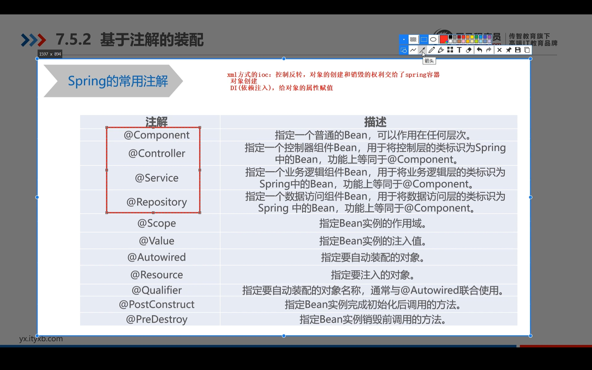

# Spring 学习

<!-- @import "[TOC]" {cmd="toc" depthFrom=1 depthTo=6 orderedList=false} -->

<!-- code_chunk_output -->

- [Spring 学习](#spring-学习)
  - [IoC 控制反转(bean)](#ioc-控制反转bean)
  - [面向切面编程](#面向切面编程)
  - [参数绑定](#参数绑定)

<!-- /code_chunk_output -->

spring 是一个框架
spring 的两大思想, ioc 和 aop
优势: 非侵入式, 解耦

spring 的组成:
基础-bean, core, context, spel
扩展-aop aspect
后端-jdbc, orm
前端-web, servlet, websocket

## IoC 控制反转(bean)

inverse of control(控制反转) 的实现是依赖注入(independency inject).

- 基于 xml 的使用:

```xml
<beans id="" name="" class="类名" scope="">
</beans>
```

id,name: 定义该 bean 的标识符, 用于后期获取该 bean
class: 指定该 bean 所指定的类对象
scope: singleton 单例模式, propotype 多例模式

1. 基于构造函数

```xml
<beans>
<bean>
<constructor-arg name="" type="" index="" value="" ref=""></constructor-arg>
</bean>
</beans>
```

name: 指定属性名
type: 通过属性类型指定
index: 通过构造函数下标

value: 通过普通值传递
ref: 通过引用类型传递 2. 基于属性

- 基于注解的使用:
  

```xml
<context:component-scan base-package="com.spring03"/>
```

- bean 获取

```java
public test() {
    ApplicationContext ac = new ClassPathXmlApplicationContext("application.xml");
    Object o = ac.getBean("name");
}
```

## 面向切面编程

- jdk 动态代理

只能用于接口, 原理是通过 implements 实现 来实现的.

- glib 动态代理

原理是通过类继承来实现的,可以用于类

## 参数绑定

默认的参数有:

1. HttpServletRequest 请求对象
2. HttpServletResponse 响应对象
3. HttpSession: session 对象
4. Model: spring mvc 中用于存放页面数据

- 简单数据类型绑定

1. 参数与局名称一致即可自动获取
2. 当参数和形参不一致可以通过 @RequestParam(value,name,required,defaultValue) 来进行指定
3. @PathVariable(value) 处理 url 上的参数

- 复杂类型绑定

数组: String[] ids
集合绑定: (@RequestParam("ids") List<int> ids) 注解必须加上

- POJO 绑定

1. 通过类对象进行绑定, 必须要保证参数名和属性名字一致.
2. 此时属性可以为 对象(传参 属性.属性), list(传参 属性[index].属性), map(传参 属性['name'].属性)

- json 属性绑定

@RequestBody
