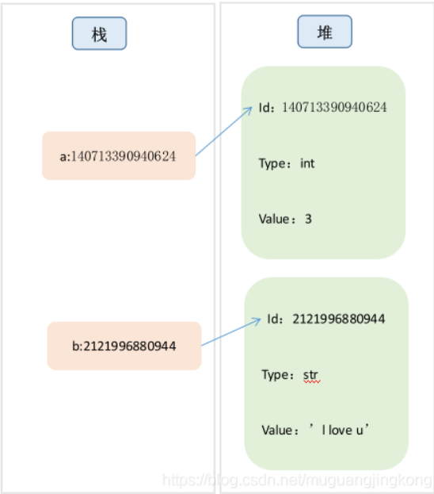

# python doc

<!-- @import "[TOC]" {cmd="toc" depthFrom=1 depthTo=6 orderedList=false} -->

<!-- code_chunk_output -->

- [python doc](#python-doc)
  - [说明](#说明)
  - [I. 数据类型](#i-数据类型)
  - [II. 流程控制](#ii-流程控制)
  - [III. os 和 sys 模块](#iii-os-和-sys-模块)
  - [IV. 网路模块](#iv-网路模块)

<!-- /code_chunk_output -->

## 说明

python 是面向对象的解释型、高级、通用编程语言，是一种动态语言

变量作用域有: 全局, 方法内, 类内

python 基本操作

```python
"""
help: python 内置函数, 获取对应参数的帮助信息
dir: python 内置函数, 获取参数对象的内置属性信息
type: python 内置函数, 获取参数对象的类型
isinstance: python 内置函数, 判断参数对象是否是指定类型的对象
"""
help
dir
type
isinstance

"""
is: 判断两个引用是否指向同一个对象
==: 判断两个对象是否相等
"""
a = [1, 2, 3]
b = a
a == b  # True
a is b  # True

"""
"""
```

python 数据内存模型


## I. 数据类型

- 基本数据类型

int, float, str, bool: 整形、浮点数、字符串, boolean 类型

python 内整数超过数据类型后会自动变为大整数, 因此没有范围边界限制

```python
"""str操作
前缀 r: 代表普通字符串
前缀 f: 格式化字符串
后缀.format: 格式化字符串
"""
s1 = 'hello'
s2 = r'c:\hello\world'
s3 = f'{s1}, world'
s4 = '{}, world'.format(s1)
```

- 序列类型

list, tuple: 列表和元组

区别: tuple 内元素不可变, list 可变

list 操作

```python
num = [1, 2, 3]
# 插入
num.append(4) # 后面追加元素
num.insert(0, 0) # 在位置 0 处插入元素

b = [5, 6, 7]
num = num + b  # 同extend() 合并两个列表到一个
# num = [0, 1, 2, 3, 4, 5, 6, 7]

# 删除

num.pop() # 删除最或的元素
num.pop(1) # 删除下标为1 的元素
num.remove(3) # 删除所有值为3的元素

#
num.count(5) # 统计列表内元素为 5 的个数
num.index(5) # 输出列表内元素为 5 的第一个元素的下标
0 in num # 判断0 是否在列表内
```

tuple 类似 list(不可修改)

只有 count, index 两个方法

- 非序列元素

set, dict: 集合和字典

set 操作

```python
# 定义集合,  空集合用 set()
st1 = {'a', 'b', 'c'}
st1.add('d') # 添加元素
st1.update('d') # 添加元素
st1.remove('a') # 移除 'a'

st2 = {'c', 'd', 'e', 'f'}

st1 & st2 # 两个集合取交集
st1 | st2 # 两个集合取并集
st1 - st2 # 取st1内有, st2 内没有的元素
st1 ^ st2 # 取st1 和st2 内独有的元素
```

dict 操作

```python
dt = {'a': 12,'b': 13}

dt.items() # 返回 键 - 值的列表

dt.keys() # 返回所有键的列表

dt.values() # 返回所有值的列表
```

## II. 流程控制

- if 语句

```python
num = 12
if num == 1:
  print("num 等于1")
elif num == 1 or num == 2:
  print("num 等于1 或者2")
elif num == 1 and num == 2:
  print("num 等于1 并且等于2")
else:
  print("num 未知")
```

- 循环语句

```python
# 普通递增迭代
for val in range(1, 10):
  print(val)

# 遍历list
nums = [6,5,4,3,2,1]
for val in nums:
  print(val)

# 遍历dict
dt = {'a': 12,'b': 13}
for k, v in dy.items():
  print(k, v)
```

- 函数

```python
def sum(a, b):
  return a + b
```

- 类

```python
class Base:
  def __init__(self, a, b):
    self.a = a
    self.b = b
```

## III. os 和 sys 模块

- os 模块

os 模块是 python 程序和系统交互的模块

文件系统操作: 主要集中在 os.path 内

```python
import os
"""1. 获取当前工作目录
getcwd: 获取当前工作路径
listdir: 获取目录和文件列表(包含文件)
"""
os.getcwd()
os.listdir(path=os.getcwd())

"""2. xx
join: 合并文件路径
split: 分割路径为文件夹和文件名(返回元组)
"""
os.path.join(dirname, filename)
os.path.split(path)

"""2. os.wald 递归遍历所有文件和文件夹
root: 代表当前层次的目录
dirs: 代表当前 root 目录下的所有文件夹
files: 代表昂前 root 目录下的所有文件
"""
for root,dirs,files in os.walk(os.getcwd()):
    for file in files:
        print(os.path.join(root,file))
```

子程序调用

```python
import os
"""
1. 运行shell程序, 只能获取运行的结果(返回状态码)
"""
os.system("ls")

"""
2. 匿名管道, 可以获取程序的输出结果(获取执行的信息)
"""
with os.popen("ls") as p:
    print(p.readlines())
```

- sys 模块

sys 模块是 python 和 python 解释器交互的一个模块

```python
import sys
#  退出程序, 退出状态码为 0x0
sys.exit(0)
```

## IV. 网路模块

参考: [爬虫](./%E7%88%AC%E8%99%AB.md)
